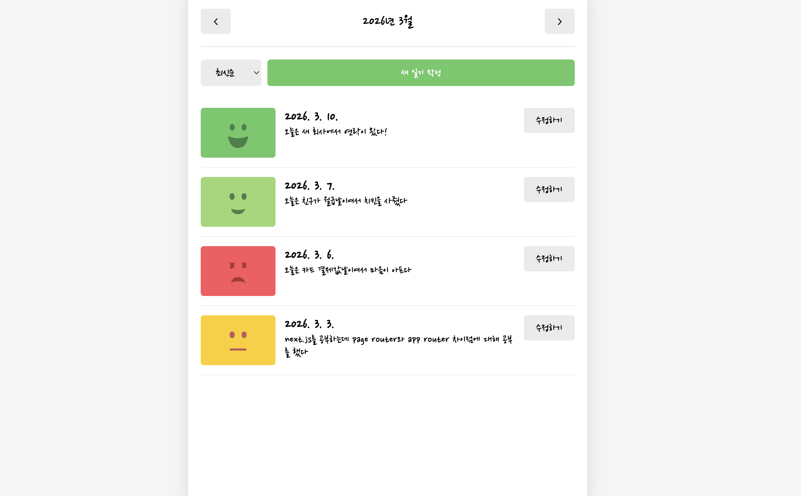
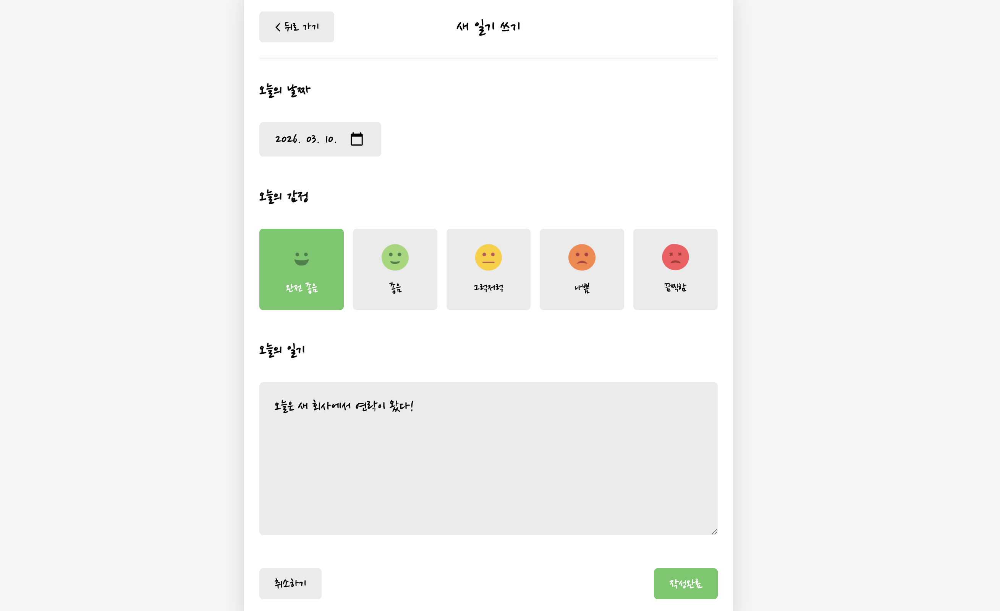
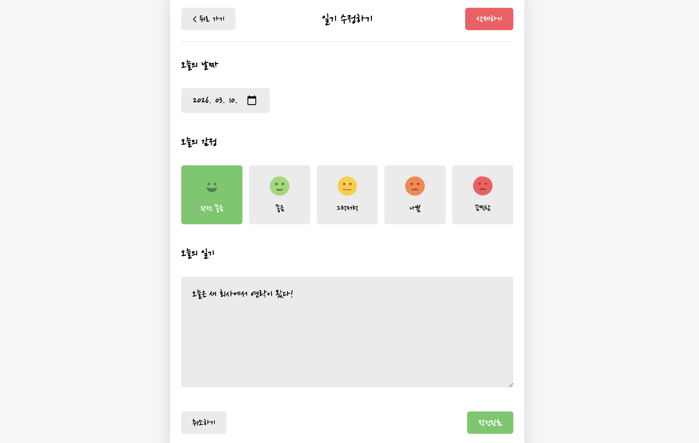

# emotionDiary

하루의 감정과 일기를 기록하고, 월 단위로 조회/관리할 수 있는 감정 일기 서비스입니다.

## 1. 프로젝트 개요

- 목적: 프론트엔드 단일 앱에서 CRUD 흐름과 전역 상태 설계를 학습
- 핵심 포인트: Context API + useReducer 구조화, localStorage 영속화, 커스텀 훅 분리
- 개발 형태: 개인 프로젝트

## 2. 링크

- 배포: https://emotiondiary-pi.vercel.app
- 저장소: https://github.com/guiyoung2/emotionDiary

## 3. 주요 기능

- 일기 작성/수정/삭제
- 감정(5단계) 선택과 기록
- 월 단위 일기 목록 조회
- 일기 상세 조회
- 로컬 저장소 기반 데이터 영속화

## 4. 기술 스택

- Frontend: React 19, TypeScript, React Router, Vite
- State: Context API, useReducer
- Persistence: localStorage

## 5. 기술 선택과 구현 포인트

### Context 분리 설계

- `DiaryStateContext`(읽기)와 `DiaryDispatchContext`(쓰기)를 분리해 구독 범위를 명확히 했습니다.
- 상태와 액션 책임을 분리해 컴포넌트 재사용성과 유지보수성을 높였습니다.

### reducer 중심 상태 변경 + 영속화

- 생성/수정/삭제 액션을 reducer에서 일관되게 처리했습니다.
- localStorage와 초기 복원 로직을 결합해 새로고침 이후에도 데이터가 유지되도록 구성했습니다.

### 커스텀 훅으로 관심사 분리

- `useDiary`: 라우트 파라미터 기반 데이터 조회 및 가드 처리
- `usePageTitle`: 페이지별 문서 타이틀 업데이트 로직 재사용

## 6. 라우팅

- `/` 홈(월별 목록)
- `/new` 작성
- `/diary/:id` 상세
- `/edit/:id` 수정
- `*` 404

## 7. 프로젝트 구조

```text
src/
├── pages/       # Home/New/Diary/Edit/Notfound
├── components/  # Editor, Viewer, DiaryList, EmotionItem 등
├── hooks/       # useDiary, usePageTitle
├── util/        # constants, 날짜/이미지 유틸
├── type/        # 타입 정의
├── App.tsx
└── main.tsx
```

## 8. 실행 방법

```bash
npm install
npm run dev
```

## 9. 스크린샷

### 메인 화면



- 월별 일기 목록과 정렬/이동 기능을 한 화면에서 확인할 수 있도록 구성했습니다.

### 작성/수정 화면



- 감정 선택과 본문 입력을 중심으로 작성 흐름을 단순하게 설계했습니다.

### 상세/조회 화면



- 저장된 일기 데이터를 읽기 전용으로 확인할 수 있고, 수정/삭제 흐름으로 자연스럽게 연결됩니다.

## 10. 트러블슈팅

### 1) 새로고침 후 데이터는 남아있는데 ID 충돌이 발생하는 문제

- 문제: localStorage에서 데이터를 복원한 뒤 새 일기를 작성하면 기존 ID와 중복되는 케이스가 있었습니다.
- 원인: 앱 재시작 시 다음 ID 기준값이 초기화되어, 이미 사용 중인 ID 범위를 고려하지 못했습니다.
- 해결: 초기화 단계에서 기존 데이터의 최대 ID를 계산하고, `useRef`로 다음 ID를 추적하도록 변경했습니다.
- 결과: 새로고침 이후에도 일기 생성 시 ID 충돌 없이 안정적으로 CRUD가 동작했습니다.

### 2) Context 사용 시 불필요한 리렌더링이 발생하는 문제

- 문제: 상태 조회와 액션 호출을 함께 구독할 때, 단순 액션 호출 컴포넌트까지 자주 리렌더링되었습니다.
- 원인: 단일 Context에 상태와 dispatch를 함께 넣어 구독 범위가 넓어졌습니다.
- 해결: `DiaryStateContext`와 `DiaryDispatchContext`를 분리해 읽기/쓰기 책임을 분리했습니다.
- 결과: 컴포넌트 렌더링 범위가 줄어들고 구조 이해도와 유지보수성이 함께 개선되었습니다.
